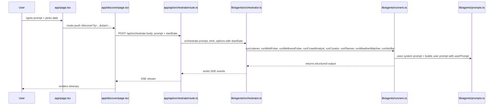

# Travel Lifestyle Feature — Analysis & Implementation Plan

## 1. Current Data Flow



### Parameter Flow Summary

| Step | File | Parameters Passed |
|------|------|-------------------|
| URL params | `app/page.tsx` L55-57 | `q` = prompt, `start` = startDate |
| Read params | `app/discover/page.tsx` L94-95 | `params.get q`, `params.get start` |
| POST body | `app/discover/page.tsx` L117-119 | `{ prompt, startDate }` |
| Parse body | `app/api/orchestrate/route.ts` L16-20 | `body.prompt`, `body.startDate` |
| Call orch | `app/api/orchestrate/route.ts` L58 | `orchestrate prompt, emit, { startDate }` |
| Orch signature | `lib/agents/orchestrator.ts` L119-123 | `userPrompt, emit, { startDate? }` |
| Runner calls | `lib/agents/orchestrator.ts` L149+ | `runX({ userPrompt, ... })` |
| generateObject | `lib/agents/runners.ts` L113+ | `system: PROMPT, prompt: ...userPrompt...` |

**Key insight:** `userPrompt` is the ONLY user intent signal that flows to every agent. The `startDate` only goes as far as the orchestrator for date math. There is NO lifestyle/style parameter anywhere in the chain.

---

## 2. Files & Lines That Must Change

### 2.1 New Type — `lib/types.ts`

| Line | Change |
|------|--------|
| After L8 | Add `TravelLifestyle` union type |
| L363-368 | Add `lifestyle?` field to `UserQuery` interface |

### 2.2 Home Page UI — `app/page.tsx`

| Line | Change |
|------|--------|
| L4 imports | Add `useState` already imported; may need a Select/dropdown component |
| After L48 | Add `const [lifestyle, setLifestyle] = useState<string>("DEFAULT")` |
| L55-57 | Add `lifestyle` to URLSearchParams: `params.set("lifestyle", lifestyle)` |
| L121-137 | Add a lifestyle dropdown next to the date picker in the composer form |

### 2.3 Discover Page — `app/discover/page.tsx`

| Line | Change |
|------|--------|
| L94-95 | Read `lifestyle` from URL: `const lifestyle = params.get("lifestyle") ?? "DEFAULT"` |
| L117-119 | Add `lifestyle` to POST body: `{ prompt, startDate, lifestyle }` |
| L304-321 | Display selected lifestyle badge in the prompt panel |

### 2.4 API Route — `app/api/orchestrate/route.ts`

| Line | Change |
|------|--------|
| L16-20 | Parse `lifestyle` from body, add to type annotation |
| After L27 | Validate `lifestyle` against allowed values |
| L58 | Pass `lifestyle` to orchestrator: `orchestrate(prompt, emit, { startDate, lifestyle })` |

### 2.5 Orchestrator — `lib/agents/orchestrator.ts`

| Line | Change |
|------|--------|
| L122 | Add `lifestyle?` to options type: `{ startDate?: string; lifestyle?: string }` |
| L149 | Pass `lifestyle` to `runListener` |
| L221-224 | Pass `lifestyle` to `runWebPulse` |
| L206-219 | Pass `lifestyle` to `runWellnessPulse` |
| L467-472 | Pass `lifestyle` to `runCrowdAnalyst` |
| L535-539 | Pass `lifestyle` to `runCurator` |
| L567-571 | Pass `lifestyle` to `runPlanner` |
| L704 | Pass `lifestyle` to `runWeatherWatcher` |
| L729-740 | Pass `lifestyle` to `runVerifier` |

### 2.6 Runner Functions — `lib/agents/runners.ts`

Every `runX` function signature needs `lifestyle?: string` added to its args type, and the lifestyle context must be injected into the prompt. Specific lines:

| Line | Function | Change |
|------|----------|--------|
| L108-129 | `runListener` | Add `lifestyle?` to args; inject into prompt |
| L131-189 | `runCrowdAnalyst` | Add `lifestyle?` to args; inject into prompt |
| L191-247 | `runCurator` | Add `lifestyle?` to args; inject into prompt |
| L249-284 | `runPlanner` | Add `lifestyle?` to args; inject into prompt |
| L286-430 | `runWebPulse` | Add `lifestyle?` to args; inject into prompt |
| L432-477 | `runWeatherWatcher` | Add `lifestyle?` to args; inject into prompt |
| L516-636 | `runWellnessPulse` | Add `lifestyle?` to args; inject into prompt |
| L638-684 | `runVerifier` | Add `lifestyle?` to args; inject into prompt |

### 2.7 Agent Prompts — `lib/agents/prompts.ts`

No structural changes needed to the static prompt strings. Instead, the lifestyle context is injected dynamically into the user prompt in each runner. However, optionally add a `LIFESTYLE_CONTEXT` helper:

| Line | Change |
|------|--------|
| After L154 | Add `LIFESTYLE_CONTEXT` map that returns lifestyle-specific guidance per agent |

---

## 3. Recommended Travel Lifestyle Options

Based on analysis of the existing `vibe_tags` in `data/hidden_gems.json`, the `GemCategory` type in `lib/types.ts`, and Thai tourism patterns:

```typescript
export type TravelLifestyle =
  | "DEFAULT"        // สมดุล — current behavior, no bias
  | "ADVENTURE"      // ผจญภัย — trekking, climbing, rafting, diving, zipline
  | "METROPOLIS"     // เมืองใหญ่ — urban exploration, street art, cafes, shopping
  | "WALKING_STREET" // ถนนคนเดิน — night markets, walking streets, local markets
  | "NIGHT_LIFE"     // กลางคืน — bars, clubs, rooftop, night bazaars
  | "WELLNESS"       // สุขภาพ — spa, yoga, meditation, detox, onsen
  | "FOODIE"         // อาหาร — street food trails, cooking classes, local cuisine
  | "CULTURE"        // วัฒนธรรม — temples, museums, festivals, traditional arts
  | "NATURE"         // ธรรมชาติ — national parks, waterfalls, wildlife, hiking
  | "BEACH"          // ชายหาด — islands, snorkeling, beach bars, sunsets
  | "PHOTOGRAPHY"    // ถ่ายรูป — viewpoints, golden hour, Instagram spots;
```

### Why these options fit Thailand:

| Lifestyle | Thai-specific rationale |
|-----------|------------------------|
| `ADVENTURE` | Thailand has world-class trekking in the North, diving in the South, white-water rafting in Kanchanaburi, ziplining in Chiang Mai |
| `METROPOLIS` | Bangkok is a metropolis with BTS/MRT, hidden cafes, street art districts like Charoen Krung |
| `WALKING_STREET` | Iconic Thai concept: Chiang Mai Sunday Walking Street, Pattaya Walking Street, Phuket Weekend Market |
| `NIGHT_LIFE` | Bangkok nightlife is world-famous; also night bazaars, rooftop bars, riverside dining |
| `WELLNESS` | Already have Wellness Pulse agent; this would amplify wellness-first planning |
| `FOODIE` | Thai street food is legendary; Michelin Guide Bangkok; midnight food tours |
| `CULTURE` | Temple-heavy country; Lanna culture, Isan festivals, Royal Thai traditions |
| `NATURE` | 155+ national parks; Doi Inthanon, Khao Sok, Erawan Falls |
| `BEACH` | 3000km coastline; Andaman + Gulf; anti-overtourism angle fits perfectly |
| `PHOTOGRAPHY` | Social media drives Thai tourism; viewpoint culture is huge |

### Mapping to existing `vibe_tags` and `category`:

The existing `HiddenGem` dataset already has `category: GemCategory` and `vibe_tags: string[]`. The lifestyle parameter would bias agent scoring toward gems whose category/vibe_tags overlap with the selected lifestyle:

| Lifestyle | Biased categories | Biased vibe_tags |
|-----------|-------------------|------------------|
| ADVENTURE | `adventure`, `nature` | trekking, hiking, diving, rafting, adrenaline |
| METROPOLIS | `food`, `culture` | urban, cafe, street-art, shopping, boutique |
| WALKING_STREET | `food`, `culture` | market, walking-street, night-market, local |
| NIGHT_LIFE | `food`, `beach` | nightlife, bar, rooftop, live-music |
| WELLNESS | `village`, `nature` | spa, yoga, meditation, quiet, retreat |
| FOODIE | `food` | street-food, local-cuisine, cooking, market |
| CULTURE | `temple`, `culture` | temple, museum, festival, traditional, heritage |
| NATURE | `nature`, `adventure` | waterfall, hiking, wildlife, national-park |
| BEACH | `beach` | beach, island, snorkeling, sunset, diving |
| PHOTOGRAPHY | any | viewpoint, scenic, golden-hour, instagram |

---

## 4. Agent Prompt Adjustment Strategy

### Approach: Dynamic Lifestyle Injection

Rather than modifying the static system prompts, inject a **lifestyle context paragraph** into the user prompt of each runner. This keeps system prompts cache-friendly and avoids duplicating 8 prompts × 11 lifestyles.

#### Implementation Pattern

Add a helper function in `lib/agents/prompts.ts`:

```typescript
export function lifestyleContext(
  lifestyle: string,
  agent: AgentName
): string {
  if (lifestyle === "DEFAULT") return "";
  
  const CONTEXTS: Record<string, Partial<Record<AgentName, string>>> = {
    ADVENTURE: {
      listener: "The user wants an ADVENTURE trip. Prioritize gems with trekking, climbing, rafting, diving, or adrenaline activities. Favor nature and adventure categories.",
      curator: "Score adventure-oriented gems higher. Look for vibe_tags like trekking, hiking, diving, rafting.",
      planner: "Plan active days: early starts for hikes, afternoon adventures. Pick bases near trailheads or dive sites.",
      // ... per-agent guidance
    },
    // ... other lifestyles
  };
  
  return CONTEXTS[lifestyle]?.[agent] ?? "";
}
```

Then in each runner, append this to the user prompt:

```typescript
// In runListener:
const lifestyleHint = lifestyleContext(args.lifestyle ?? "DEFAULT", "listener");
prompt: `...existing prompt...\n\n${lifestyleHint}`
```

### Per-Agent Impact Analysis

| Agent | How lifestyle affects it | Priority |
|-------|------------------------|----------|
| **Listener** | Biases candidate selection toward lifestyle-matching gems | 🔴 HIGH — gateway agent |
| **Crowd Analyst** | Adjusts crowd tolerance: NIGHT_LIFE tolerates higher crowds; NATURE prefers lower | 🟡 MEDIUM |
| **Curator** | Weights scoring based on lifestyle-vibe overlap | 🔴 HIGH — scoring gate |
| **Planner** | Shapes daily activities to match lifestyle: adventure = active mornings; nightlife = evening-focused | 🔴 HIGH — output gate |
| **Web Pulse** | Searches for lifestyle-relevant evidence | 🟡 MEDIUM |
| **Wellness Pulse** | Amplifies for WELLNESS lifestyle; suppresses for ADVENTURE/NIGHT_LIFE | 🟡 MEDIUM |
| **Weather Watcher** | Adjusts advice: NATURE cares more about rain; NIGHT_LIFE less affected | 🟢 LOW |
| **Verifier** | Lifestyle-specific tips: adventure = gear, beach = sun protection, temple = dress code | 🟢 LOW |

---

## 5. Implementation Todo List

### Phase 1: Type System & Data Layer
- [ ] Add `TravelLifestyle` union type to `lib/types.ts`
- [ ] Add `lifestyle?` field to `UserQuery` interface in `lib/types.ts`

### Phase 2: UI — Home Page
- [ ] Add lifestyle state to `app/page.tsx`
- [ ] Add lifestyle dropdown component in the composer form, next to date picker
- [ ] Include `lifestyle` in URLSearchParams on submit

### Phase 3: UI — Discover Page
- [ ] Read `lifestyle` from URL search params in `app/discover/page.tsx`
- [ ] Pass `lifestyle` in POST body to `/api/orchestrate`
- [ ] Display lifestyle badge in the prompt panel header

### Phase 4: API Route
- [ ] Parse and validate `lifestyle` in `app/api/orchestrate/route.ts`
- [ ] Pass `lifestyle` to `orchestrate()` function

### Phase 5: Orchestrator
- [ ] Add `lifestyle` to `orchestrate()` options type in `lib/agents/orchestrator.ts`
- [ ] Thread `lifestyle` to all 8 runner calls

### Phase 6: Prompts
- [ ] Add `lifestyleContext()` helper to `lib/agents/prompts.ts`
- [ ] Define lifestyle-specific guidance for each agent × lifestyle combination

### Phase 7: Runners
- [ ] Add `lifestyle?` to args type of all 8 runner functions in `lib/agents/runners.ts`
- [ ] Inject `lifestyleContext()` output into each runner's user prompt

### Phase 8: Verification
- [ ] Run `npx tsc --noEmit` to verify type safety
- [ ] Run `npx next build` to verify build passes
- [ ] Manual test: select each lifestyle and verify agent behavior changes

---

## 6. Constraints & Risks

1. **No schema changes needed** — Lifestyle is a prompt-level signal, not a structured output field. The Zod schemas in `lib/agents/schemas.ts` remain unchanged.

2. **Prompt token budget** — Adding lifestyle context adds ~50-100 tokens per agent call. With 8 agents, that's ~400-800 extra tokens total. Negligible for Gemini Flash Lite.

3. **Backward compatible** — `DEFAULT` lifestyle produces identical behavior to the current system. The `lifestyle` parameter is optional throughout the chain.

4. **No new agent needed** — Lifestyle is a cross-cutting concern that influences existing agents, not a new pipeline stage.

5. **UI component** — Need a styled dropdown that matches the Jasmine Modern design system. Can use a native `<select>` styled with CSS variables, or create a minimal custom component. No shadcn Select component exists in the project currently — only Button, Textarea, Badge, Card.

6. **URL length** — Adding `&lifestyle=ADVENTURE` to the URL is negligible.

7. **React Strict Mode** — No changes to the useEffect pattern in discover page. The lifestyle is read from URL params and passed through; no ref guards needed.
